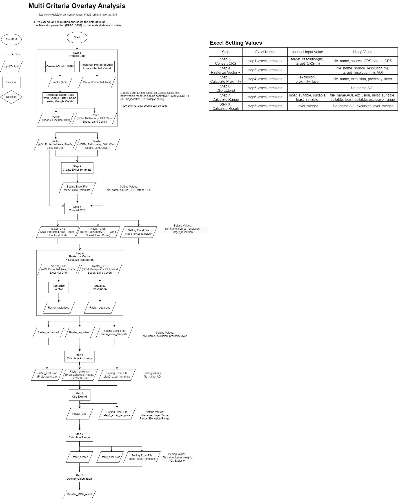
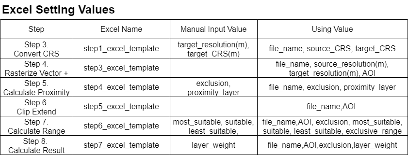

# Prerequisites
- Install Git
- Install Python
- Install Anaconda
- Install IDE(Integrated Development Environment) such as Visual Studio Code

# How to Excute the code
- Download or clone the repository
- Execute the command on Command Line or Powershall.
`conda env create -f environment.yml`
- Activate Virtual Environment for dependencies
`conda activate gis`
- Excute code

# Multi Criteria Analysis
The workflow is based on [QGIS Tutorials and Tips - Multi Criteria Overlay Analysis (QGIS3)](https://www.qgistutorials.com/en/docs/3/multi_criteria_overlay.html)

Download data with Google Earth Engine Script with the [Sample Code](https://colab.research.google.com/drive/1uMmtVNNbjE_4-qoH3WjihAMtjb1P1fSv?usp=sharing) of Google Colab

* figures can be edditted with [draw.io](draw.io)
