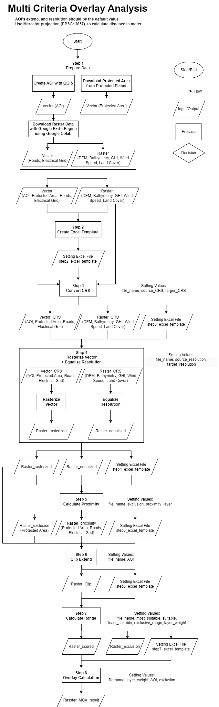

# Prerequisites
- Install Git
- Install Python
- Install Anaconda
- Install IDE(Integrated Development Environment) such as Visual Studio Code

# How to Excute the code
- Download or clone the repository
- Execute the command on Command Line or Powershell.
`conda env create -f environment.yml`
- Activate Virtual Environment for dependencies
`conda activate gis`
- Excute code

# Multi Criteria Analysis
The workflow is based on [QGIS Tutorials and Tips - Multi Criteria Overlay Analysis (QGIS3)](https://www.qgistutorials.com/en/docs/3/multi_criteria_overlay.html)

The wrokflow of MCA with QGIS is also described on [SuntraceWiki](https://wiki.suntrace.de/wiki/Analysis_%E2%80%93_MCA_for_site_selection) as well 

# Code Execution
Please follow the description below for each step of the procedure.

## Step 1: Prepare Data

1. Create an Area of Interest (AOI) as a polygon in shapefile (.shp) format using QGIS.

2. Open the 'step1_prepare_data_GEE' file with the [Sample Code](https://colab.research.google.com/drive/1uMmtVNNbjE_4-qoH3WjihAMtjb1P1fSv?usp=sharing) on Google Colab.
   - This sample code is based on a tutorial by the YouTuber ['GeoDev'](https://www.youtube.com/watch?v=7fC7YqhoOPE). Please refer to the video for guidance on using the 'geemap' library.
   - In case the Colab link is lost, please check the backup code in [Jupyter Notebook format (.ipynb)](src/module/step1_prepare_data_GEE.ipynb).

3. Upload the shapefile of the AOI to the 'content' directory.

   

4. Execute the code to download each data in use. The downloaded data will be displayed under the 'content' directory.

5. Download the data to the 'data\step1' directory of the project.

## Step 2: Create Excel Template

1. Execute 'step2_create_excel_template.py' with an IDE (such as Visual Studio Code).
   - This will create 'step2_excel_template.xlsx' in the 'data\setting_excel' directory.

2. Fill in the 'target_CRS', 'target_resolution(m)', and 'AOI' fields in 'step2_excel_template.xlsx' as desired.
   - 'target_CRS' should be in the 'EPSG:XXXX' format.
   - 'target_resolution' should be an integer number with the meter unit.
   - 'AOI' should have a value of '1' (multiple AOIs can be specified, but the first one will be considered the base AOI).

   

## Step 3: Convert CRS

1. Execute 'step3_convert_CRS.py' using an IDE (such as Visual Studio Code).
   - This script utilizes 'step2_excel_template.xlsx' from the 'data\setting_excel' directory as input for setting values.
     'file_name', 'source_CRS', and 'target_CRS' will be utilized for this step.
   - Input data is sourced from 'data\step1', where files in tif, shp, and geojson formats are read.
   - The outputs are stored in the 'data\step3' directory, with tif files retaining their original tif format, while shp or geojson files are converted to shp format using the specified target_CRS. Additionally, a suffix "_CRS" is appended to the filenames.
   - This process generates 'step3_excel_template.xlsx' in the 'data\setting_excel' directory.

2. Since the 'target_resolution' input from Step 2 is utilized, there is no need to input it again if it was already provided in Step 2.

## Step 4: Rasterize Vector + Equalize Resolution

1. Execute 'step4_rasterize_vector_equalize_resolution.py' using an IDE (such as Visual Studio Code).
   - This script utilizes 'step3_excel_template.xlsx' from the 'data\setting_excel' directory as input for setting values.
     'file_name', 'source_resolution', and 'target_resolution' will be utilized for this step.
   - Input data is sourced from 'data\step3', where files in tif and shp formats are read.
   - The outputs are stored in the 'data\step4' directory. Files in shp format are rasterized based on the 'target_resolution' and saved in tif format with the suffix '_rasterized'. Raster files in tif format have their resolution transformed based on the 'target_resolution' and saved as tif files with the suffix '_equalized'.
   - This process generates 'step4_excel_template.xlsx' in the 'data\setting_excel' directory.

2. Fill in the 'AOI', 'exclusion', and 'proximity' fields in 'step4_excel_template.xlsx' as desired.
   - 'AOI' should have a value of '1' (multiple AOIs can be specified, but the first one will be considered the base AOI).
   - 'exclusion' should have a value of '1'. 'exclusion' indicates areas that should be excluded.
   - 'proximity' should have a value of '1'. 'proximity' indicates cases where vector files (in geojson or shp format) are converted to raster and range calculation is required (e.g., roads, electrical grid...).

   

* figures can be editted with [draw.io](draw.io)
